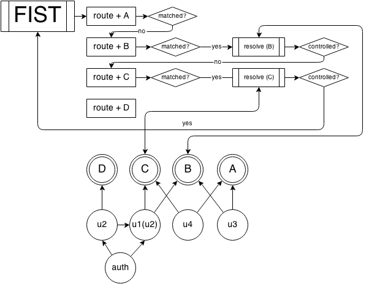

How it works
---------



Oh. My. GOD! What is the crazy image!?
Calm down. This is easy. Let me to explain the scheme.

First, ```fist``` application object (```app``` below) is http server. ```app``` has an ```Observable``` behavior that used to broadcast any application events. ```app``` can receive incoming requests and respond to client. ```app``` object is a ```FIST``` square on the scheme.

```js
var app = fist();

app.on('some-event', function (event) {
    console.log(event);
});
```

When an application starts, webserver immediately starts listening any socket or port you want, and initialization procedure begins, but async. What does it mean? ```app``` will defer any incoming requests until ```app``` not be ready, and it will handle these all pending when initialization will be done.

```js
app.plug(function (done) {
    doSomethingForALongTimeBeforeStart(function () {
        done();
    });
});
```

Okay, our ```app``` ready to work, and we receive our first request.

When ```app``` receives a request, it begins routing procedure. Let router is a sequence of same type squares marked like ```route + A``` on the scheme. ```Route``` is a part of ```Router``` which is a set of request pattern and related to some static data. The ```Router``` iterates over its routes and checks if received request is suitable for current route while not matched. If the ```Router``` has no matched routes, application will respond like ```Not Found```. But if there is a match, ```app``` will begin resolving procedure.

```js
app.route('/', 'index-page');
app.route('/avatars/<imageId>.png', 'avatar-image');
app.route('/forum', 'forum-page');
//  "e" flag means prefix matching 
// like url.match(/^\/admin\//)
//  instead of url.match(/^\/admin\/$/)
app.route('/admin/ e', 'admin-check');
app.route('/admin/pane', 'admin-pane-page');

```

As mentioned above, route is a pattern related to some data. What data in our case? It is a ```Unit``` reference. Let unit is a circles on the scheme. ```Unit``` is a static ```app``` logical unit that can do something and return result or error.

```js
app.unit({
    path: 'index-page',
    data: function (track) {
        return track.send(200, '<h1>Index</h1>');
    }
});
```

How do ```app``` resolves units? Before ```app``` begins resolving procedure, it creates a ```Track```. ```Track``` is a current request context, including API to working with request and response objects such as getting request headers, setting headers to response and much more. The current ```Track``` instance is available all the time during the execution of the resolution procedure. ```Unit``` that directly assigned with request pattern is controller.

```js
app.unit({
    path: 'avater-image',
    data: function (track, context) {
        var image = /* @type {Promise} */ getImageAnyWhere(context.arg('imageId'));
        track.header('Content-Type', 'image/png');
        return track.send(image);
    }
})
```

First ```app``` will resolve controller's dependencies, then the controller itself. ```Unit```'s result can depend on other unit results. It is an explicit dependencies feature. For each unit call, ```app``` creates a ```Context``` instance and passes it as argument. ```Context``` is an unique ```Unit```'s calling context. It has dependencies resolution results, call parameters and other special API.

```js
app.unit({
    path: 'sessionid',
    data: function (track) {
        return getSomeStuff(track.cookie('Session_id'));
    }
});

app.unit({
    path: 'forum-page',
    deps: ['sessionid'],
    data: function (track, context) {
        if ( context.getRes('sessionid.userId') ) {
            return track.send('<h1>Forum</h1>');    
        }
        return track.send(403, 'Login first!');
    }
})

```

When ```app``` has resolved controller it checks resulution status. If result is ```rejected``` then it will immediately respond with this value as error. But if not, ```app``` will check if track was controlled. If it was controlled that ```app``` will immedialely respond with its value and status code. But if not, ```app``` will continue routing procedure until ```Track``` will not being controlled.

```js
app.unit({
    path: 'admin-check',
    deps: ['sessionid'],
    data: function (track, context) {
        if ( isAdmin(context.getRes('sessionid')) ) {
            //  continue matching remaining routes
            return;
        }
        return track.send(403, 'You are not admin!');
    }
});

app.unit({
    page: 'admin-pane-page',
    data: function (track, context) {
        // do not need check rights because of under admin-check controller
        return track.send('<h1>Admin pane</h1>');
    }
});
```

Note that not only controller could return controlling objects which says to application "Hey, you must respond to client right now!". But any unit. If some dependency returns  control object, application will stop resolution procedure and will respond. 

```js
var app = fist();

app.route('/', 'page');

app.unit({
    path: 'page',
    deps: ['rebel'],
    data: function (track, context) {
        return track.send(200, 'Hello, fist!');
    }
});

app.unit({
    path: 'rebel',
    data: function (track, context) {
        return track.send(500, 'Ooops!');
    }
});

```

This application will respond ```500 Ooops!``` and controller will never executed.

That's all! Easy!

API Reference
---------
* [Application](server.md)
* [Router](router.md)
* [Unit](unit.md)
* [Track](track.md)
* [Context](context.md)
* [Plugins](plugins.md)
